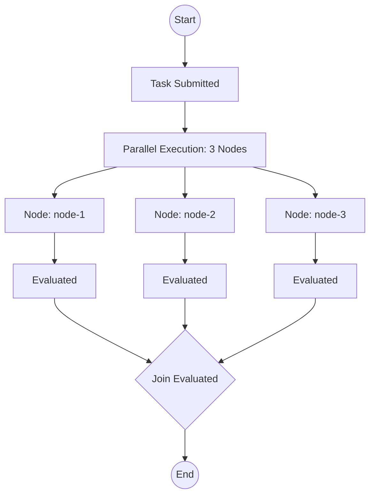

# Task Execution Report

## 1. Basic Information
- **Task ID**: `demo-task-1775543832268`
- **Status**: Completed
- **Nodes Processed**: 3
- **Join Decision**: stop

## 2. Execution Flowchart

## 3. Detailed Event Log
| Timestamp | Event Type | Key Payload Info |
| :--- | :--- | :--- |
| 2026-04-07T06:37:12.269Z | **NodeScheduled** | `{"task_id":"demo-task-1775543832268","node_id":"node-1"}` |
| 2026-04-07T06:37:12.269Z | **AgentStarted** | `{"task_id":"demo-task-1775543832268","node_id":"node-1","role":"planner"}` |
| 2026-04-07T06:37:12.270Z | **PromptComposed** | `{"task_id":"demo-task-1775543832268","node_id":"node-1"}` |
| 2026-04-07T06:37:12.270Z | **ModelCalled** | `{"task_id":"demo-task-1775543832268","node_id":"node-1"}` |
| 2026-04-07T06:37:12.270Z | **ToolInvoked** | `{"task_id":"demo-task-1775543832268","node_id":"node-1","tool":"echo"}` |
| 2026-04-07T06:37:12.271Z | **NodeScheduled** | `{"task_id":"demo-task-1775543832268","node_id":"node-2"}` |
| 2026-04-07T06:37:12.271Z | **AgentStarted** | `{"task_id":"demo-task-1775543832268","node_id":"node-2","role":"researcher"}` |
| 2026-04-07T06:37:12.271Z | **PromptComposed** | `{"task_id":"demo-task-1775543832268","node_id":"node-2"}` |
| 2026-04-07T06:37:12.271Z | **ModelCalled** | `{"task_id":"demo-task-1775543832268","node_id":"node-2"}` |
| 2026-04-07T06:37:12.271Z | **ToolInvoked** | `{"task_id":"demo-task-1775543832268","node_id":"node-2","tool":"echo"}` |
| 2026-04-07T06:37:12.271Z | **ToolReturned** | `{"task_id":"demo-task-1775543832268","node_id":"node-1","ok":true}` |
| 2026-04-07T06:37:12.272Z | **Evaluated** | `{"task_id":"demo-task-1775543832268","node_id":"node-1","decision":"stop"}` |
| 2026-04-07T06:37:12.272Z | **NodeCompleted** | `{"task_id":"demo-task-1775543832268","node_id":"node-1"}` |
| 2026-04-07T06:37:12.272Z | **ToolReturned** | `{"task_id":"demo-task-1775543832268","node_id":"node-2","ok":true}` |
| 2026-04-07T06:37:12.272Z | **Evaluated** | `{"task_id":"demo-task-1775543832268","node_id":"node-2","decision":"stop"}` |
| 2026-04-07T06:37:12.272Z | **NodeCompleted** | `{"task_id":"demo-task-1775543832268","node_id":"node-2"}` |
| 2026-04-07T06:37:12.272Z | **NodeScheduled** | `{"task_id":"demo-task-1775543832268","node_id":"node-3"}` |
| 2026-04-07T06:37:12.272Z | **AgentStarted** | `{"task_id":"demo-task-1775543832268","node_id":"node-3","role":"coder"}` |
| 2026-04-07T06:37:12.272Z | **PromptComposed** | `{"task_id":"demo-task-1775543832268","node_id":"node-3"}` |
| 2026-04-07T06:37:12.272Z | **ModelCalled** | `{"task_id":"demo-task-1775543832268","node_id":"node-3"}` |
| 2026-04-07T06:37:12.272Z | **ToolInvoked** | `{"task_id":"demo-task-1775543832268","node_id":"node-3","tool":"echo"}` |
| 2026-04-07T06:37:12.273Z | **ToolReturned** | `{"task_id":"demo-task-1775543832268","node_id":"node-3","ok":true}` |
| 2026-04-07T06:37:12.273Z | **Evaluated** | `{"task_id":"demo-task-1775543832268","node_id":"node-3","decision":"stop"}` |
| 2026-04-07T06:37:12.273Z | **NodeCompleted** | `{"task_id":"demo-task-1775543832268","node_id":"node-3"}` |
| 2026-04-07T06:37:12.273Z | **JoinEvaluated** | `{"task_id":"demo-task-1775543832268","node_count":3,"decision":"stop"}` |

## 4. Observations & Results
- **Concurrency Control**: The orchestrator correctly managed parallel execution with a limit of `max_parallel: 2`.
- **Event Trace**: A total of 25 events were captured, showing a complete lifecycle from scheduling to evaluation.
- **Mock LLM Interaction**: High-level roles (planner, researcher, coder) were simulated with success responses.

## 5. Artifacts
- **Report File**: `artifacts/run_report.md`
